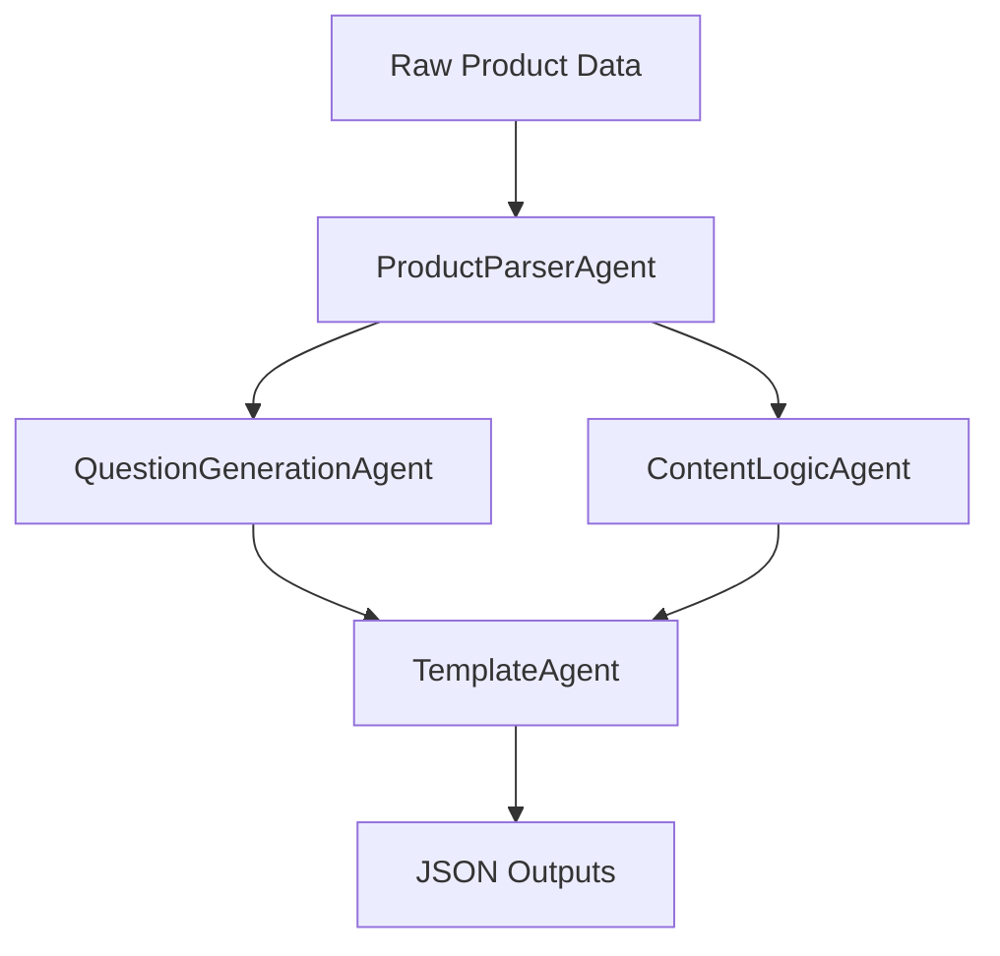
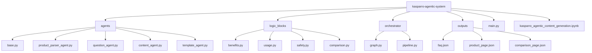

# Kasparro Agentic Content Generation System

This repository contains a **state-driven, multi-agent content generation system** developed for the Kasparro Applied AI Engineer assignment.

The system demonstrates how **autonomous agents** can dynamically coordinate via shared state to generate structured, machine-readable content from a fixed product dataset.

The emphasis of this project is on **system design, clarity, and maintainability**, not content creativity.

---

##  Problem Statement

Design and implement a modular agentic system that can:

- Parse structured product data
- Generate categorized user questions
- Apply reusable content logic
- Assemble multiple content pages
- Output clean, machine-readable JSON

The solution must prioritize:
- Agent autonomy
- Dynamic coordination
- Clear separation of responsibilities
- Production-quality architecture

---

##  Solution Overview

This system follows a **blackboard-style orchestration model**:

- Agents are **independent and autonomous**
- Each agent decides **when it should run** based on shared system state
- A neutral orchestrator repeatedly scans agents and executes those whose conditions are satisfied
- Execution order **emerges dynamically** from state changes

There is no hard-coded control flow or fixed pipeline ordering.

---

##  System Design

### Core Concepts

#### Shared State (Blackboard)
A single mutable dictionary represents shared system state.  
All agents read from and write to this state.

#### Autonomous Agents
Each agent implements:
- `can_run(state)` — determines whether the agent should execute
- `run(state)` — performs its logic and mutates shared state

Agents do not call each other directly.

#### Neutral Orchestrator
The orchestrator:
- Contains no business logic
- Does not impose execution order
- Simply schedules agents whose `can_run()` returns `true`

---

##  Execution Flow (High-Level)


**Note:** This diagram represents **state progression**, not hard-coded control flow.

---

## Folder Structure



##  Outputs

The system generates the following machine-readable JSON files:

- `faq.json`  
  Categorized user questions and answers generated from product data.

- `product_page.json`  
  Structured product information including ingredients, usage, safety, and pricing.

- `comparison_page.json`  
  A structured comparison between the primary product and a fictional Product B.

All outputs are:
- Deterministic
- Fully machine-readable
- Derived strictly from the provided dataset (no external data)

---

##  Design Principles

The system is intentionally designed with the following principles:

- **Clarity over clever hacks**  
  Logic is explicit and easy to follow.

- **Agent autonomy**  
  Each agent independently decides when it should execute.

- **No hard-coded control flow**  
  Execution order emerges from shared state, not fixed pipelines.

- **Reusable logic blocks**  
  Content logic is stateless and modular.

- **Maintainability first**  
  Code is written assuming another engineer will maintain and extend it.

---

##  How to Run

### Option 1: Run using Python

From the project root:

```markdown
```bash
python main.py
```
This will:
Execute the agent orchestration, generate all output JSON files and save them inside the outputs/ directory

### Option 2: Run using Google Colab

Open and run all cells in:

`kasparro_agentic_content_generation.ipynb`
---

## Scope & Assumptions

- Only the provided product dataset is used
- Product B is fictional but structurally consistent
- No external APIs or LLMs are involved
- The focus is on **system design**, not content creativity
- Outputs are intended for downstream machine consumption

---

## Summary

This project demonstrates a production-style **multi-agent system** featuring:

- Autonomous agents with clear responsibilities
- State-driven coordination via a blackboard architecture
- Clean abstractions and modular logic blocks
- Maintainable and extensible design

The implementation prioritizes clarity, correctness, and long-term maintainability over shortcuts or hard-coded logic.

